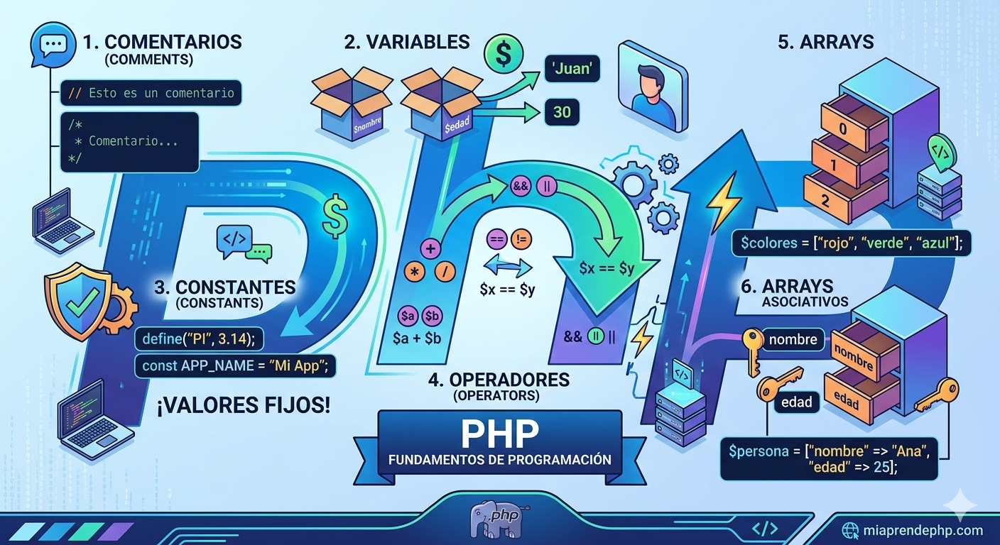

# TEMA 1


# intro_php

# Fundamentos de PHP

## ¿Qué es PHP?
PHP (Hypertext Preprocessor) es un lenguaje de programación del lado del servidor. Se ejecuta en el servidor y genera contenido que el usuario ve en el navegador. Se usa para crear páginas web dinámicas, procesar formularios y conectar con bases de datos.

---

## Comentarios en PHP
Los comentarios son líneas que el programa ignora y sirven para explicar el código.

Tipos:
```php
// Una línea
# Una línea

/* Varias líneas */
Variables en PHP

Las variables almacenan datos que pueden cambiar.

Características:

Empiezan con $
No requieren tipo de dato
Son sensibles a mayúsculas

Ejemplo:

$nombre = "Juan";
$edad = 20;
Constantes

Las constantes son valores que no cambian.

Características:

No usan $
Se definen una sola vez
Son globales

Ejemplo:

define("PI", 3.1416);
Operadores en PHP

Permiten realizar operaciones.

Tipos:

Aritméticos: +, -, *, /
Comparación: ==, !=, >, <
Lógicos: &&, ||, !

Ejemplo:

$a = 10;
$b = 5;
$resultado = $a + $b;
Arrays

Permiten almacenar varios valores en una sola variable.

Ejemplo:

$frutas = array("manzana", "pera", "uva");
echo $frutas[0];
Arrays Asociativos

Usan claves en lugar de índices numéricos.

Ejemplo:

$persona = array(
    "nombre" => "Juan",
    "edad" => 20
);

echo $persona["nombre"];
Diferencia entre Arrays
Array normal: usa índices numéricos
Array asociativo: usa claves personalizadas

